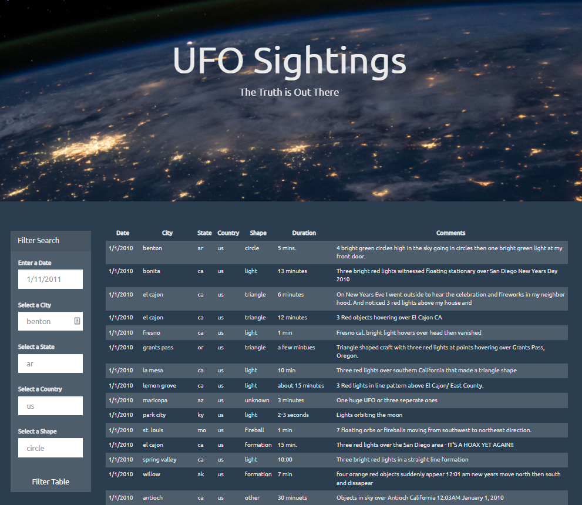

# javascript-table-filter-ufo  

Author: Erin James Wills, ejw.data@gmail.com  

<<<<<<< HEAD

<cite>Photo by [Marek Piwnicki](https://unsplash.com/@marekpiwnicki?utm_source=unsplash&utm_medium=referral&utm_content=creditCopyText) on [Unsplash](https://unsplash.com/s/photos/ufo?utm_source=unsplash&utm_medium=referral&utm_content=creditCopyText)</cite>
=======

 
## Objective
### This repo is a personal project of a javascript generated table from a json file that also includes filtering capabilities .  I will continue to add onto this repo with new additions and improvements. 
 

## Sample Tables
https://ejw-data.github.io/javascript-filtering/basic-1/  
https://ejw-data.github.io/javascript-filtering/basic-2/

 
 

## Notable Revisions
>>>>>>> 1cf957413de6aa628390d60a3a4233865fb39ad6

 

## Overview

This repo is a personal project of a javascript generated table from a json file that also includes filtering capabilities.

 

## Github Pages  
https://ejw-data.github.io/javascript-challenge/basic-1/   

https://ejw-data.github.io/javascript-challenge/basic-2/   

 

## Technologies    
*  HTML/CSS/JS

 

## Data Source  
Original dataset came from Trilogy Education Services.    

 

## Setup and Installation  
1. Clone the repo to your local machine
1. Open repo folder in an IDE like VSCode
1. Using a virtual server like the VSCode extention LiveServer
1. Run `basic-2/index.html`  

 

## Example

 

